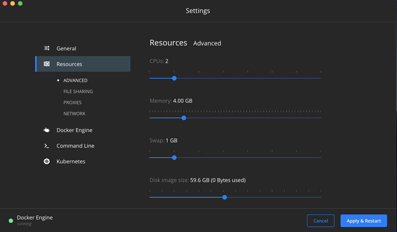

# Elastic Stack Workshop

Este repositorio es el fuente para el workshop del Elastic Stack en el que se va a ejecutar el stack mediante Docker Compose para demostrar algunas de las capacitades de Observabilidad del stack.

Este workshop se basa en la versión 7.3.2. el stack. Configurada en el fichero [.env](.env).

## Pre-requisitos

- Docker y Docker Compose. Se ha probado con docker versión 19.03.2 y docker-compose 1.24.1.
  - Usuarios de Windows y Mac users tendrán Compose instalado automáticamente con Docker para [Windows](https://docs.docker.com/docker-for-windows/install/)/[Mac](https://docs.docker.com/docker-for-mac/install/).
  - Los usuarios de Linux puede leer las [instrucciones de instalación](https://docs.docker.com/compose/install/#install-compose) o pueden instalar vía `pip`:
  
    ```shell
    pip install docker-compose
    ```

- Un mínimo de 4GiB de RAM para contenedores. Los usuarios de Mac y Windows deben configurar su máquina virtual Docker para disponer de ese mínimo.

    

- Debido a que que por defecto la [memoria virtual](https://www.elastic.co/guide/en/elasticsearch/reference/7.3/vm-max-map-count.html) no es suficiente, los usuarios de Linux deben ejecutar el siguiente comando como `root`:

```
sysctl -w vm.max_map_count=262144
```

## Contenido del workshop

En este workshop se demostrarán las capacidades básicas del Stack Elastic para ingesta de logs y métricas. Los pasos a seguir son los siguientes:

1. [Introducción al Stack Elastic](./doc/paso01/README.md)
 - En este apartado, se arrancará un stack elastic con un cluster de un nodo de [Elasticsearch](https://www.elastic.co/guide/en/elasticsearch/reference/7.3/index.html), una instancia de [Kibana](https://www.elastic.co/guide/en/kibana/7.3/index.html), y varios [Beats](https://www.elastic.co/guide/en/beats/libbeat/7.3/beats-reference.html): [Metricbeat](https://www.elastic.co/guide/en/beats/metricbeat/7.3/index.html) y [Heartbeat](https://www.elastic.co/guide/en/beats/heartbeat/7.3/index.html).
 - Veremos como utilizar Kibana para visualizar las métricas ([Discover](https://www.elastic.co/guide/en/kibana/7.3/discover.html) e [Infrastructure UI](https://www.elastic.co/guide/en/kibana/7.3/xpack-infra.html)), así como el uso de [Uptime](https://www.elastic.co/guide/en/kibana/7.3/xpack-uptime.html).
2. [Ingesta de logs](./doc/paso02/README.md)
 - Usaremos [Filebeat](https://www.elastic.co/guide/en/beats/filebeat/7.3/index.html) o [Logstash](https://www.elastic.co/guide/en/logstash/current/index.html) para la ingesta de logs en Elasticsearch y los visualizaremos con Kibana [Logs UI](https://www.elastic.co/guide/en/kibana/7.3/xpack-logs.html).
3. [Modelado simple de logs](./doc/paso03/README.md)
 - Reingestaremos estos logs, esta vez modelando los campos. Crearemos nuestro primer [dashboard](https://www.elastic.co/guide/en/kibana/7.3/dashboard.html) para visualizar la información agregada.
4. [¿Por dónde seguir?](./doc/paso04/README.md)
 - Daremos algunos consejos sobre posibles siguientes pasos.