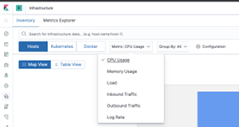

# Introducción al Stack Elastic

**Nota**.  Para iniciar el stack, es necesario que no haya ningún servicio arrancado en los puertos 9200, 9300 (elasticsearch), 5601 (kibana).

En este apartado vamos a arrancar el stack elastic definido en [docker-compose.yml](../../docker-compose.yml).


El objetivo es triple:

1. Comprobar como funciona el servicio de [Uptime](https://www.elastic.co/guide/en/kibana/7.3/xpack-uptime.html) con los datos recolectados por [Heartbeat](https://www.elastic.co/guide/en/beats/heartbeat/7.3/index.html).
2. Visualizar algunas métricas de nuestra [Infraestructura](https://www.elastic.co/guide/en/kibana/7.3/xpack-infra.html) con los datos recolectados por [Metricbeat](https://www.elastic.co/guide/en/beats/metricbeat/7.3/index.html) de sistema y docker.
3. Explorar la vista de [Discover](https://www.elastic.co/guide/en/kibana/7.3/discover.html) en Kibana.

Para ello, ejecutaremos desde el raíz del proyecto:

```shell
docker-compose up -d
```

Ejecutaremos `docker ps` para comprobar que tenemos 4 contenedores en estado healthy (heartbeat, metricbeat, kibana, elasticsearch).

Podemos también comprobar en los logs si han arrancado correctamente.

```shell
docker logs -f elasticsearch
docker logs -f kibana
docker logs -f heartbeat
docker logs -f metricbeat
```

A continuación, abriremos la URL de Kibana en un navegador (ver [supported browsers](https://www.elastic.co/es/support/matrix#matrix_browsers)).

- http://localhost:5601/
- Usuario: elastic
- Password: changeme

## Uptime

Una vez en la página inicial de kibana, pulsaremos **Uptime** en el menú izquierdo.


Y nos aparecerá la siguiente pantalla, con los datos que Heartbeat va recolectando y enviando a Elasticsearch:


Podemos consultar la configuración de Hearbeat en el fichero [heartbeat/config/heartbeat.yml](../../heartbeat/config/heartbeat.yml). Estamos realizadon un ping icmp a 3 contenedores (elasticsearch, kibana y metricbeat), y adicionalmente monitorizamos via http que nos responden tanto Elasticsearch como Kibana.

```yaml
heartbeat.monitors:

# Monitor all containers using icmp / ping
- type: icmp
  schedule: '*/5 * * * * * *'
  hosts: ["elasticsearch","metricbeat","kibana"]
  ipv4: true
  ipv6: true
  mode: any
  timeout: 3s
  wait: 1s

# Monitor the Elasticsearch instance via http
- type: http
  enabled: true
  schedule: '@every 5s'
  urls: ["http://elasticsearch:9200"]
  ipv4: true
  ipv6: true
  mode: any
  timeout: 3s
  username: '${ES_USERNAME:elastic}'
  password: '${ES_PASSWORD:changeme}'
  check.request:
    method: "GET"
  check.response:
    status: 200

# Monitor the Kibana instance
- type: http
  enabled: true
  schedule: '@every 5s'
  urls: ["http://kibana:5601"]
  ipv4: true
  ipv6: true
  mode: any
  timeout: 3s
  check.request:
    method: "GET"
  check.response:
    status: 200
```

Más información sobre como configurar Heartbeat en la  [documentación](https://www.elastic.co/guide/en/beats/heartbeat/7.3/configuring-howto-heartbeat.html).

Ahora pararemos el contendor `metricbeat`, para observar como Uptime nos reportará el evento.

Ejecutamos:

```shell
docker-compose stop metricbeat
```

Pulsando el botón `Refresh` en la parte superior izquierda, veremos que tenemos 4 servicios levantados y uno que no contesta, `metricbeat`.


Haciendo clic en el enlace del servicio caído, `metricbeat`, podremos ver el detalle de dicha monitorización, por ejemplo, cuando empezó a fallar.


Para finalizar, reiniciamos metricbeat ejecutando:

```shell
docker-compose up -d
```

Y comprobamos que el servicio reaparece como operativo en `Uptime`.

## Infraestructura

A continuación exploraremos la vista de infraestructura. En el menú la izquierda en Kibana, pulsar en la opción `Infrastructure`.


La página principal muestra una vista de los servidores que tenemos monitorizados con Metricbeat. 


Podemos observar que aparece un único Host, nuestro entorno local. Y podemos seleccionar distintas métricas en el menú `Metric` (CPU, memoria, I/O, etc.).



Si seleccionamos `Docker` en vez de `Hosts` en el menú superior, podemos ver las métricas de nuestros contenedores. La opción `Auto-refresh` en la esquina superior derecha nos permite actualizar las métricas a medida que van entrando.

Haciendo clic en un contenedor, por ejemplo `elasticsearch`, podemos pulsar la opción `View metrics`:


E ir al detalle de métricas para ese contenedor.


La configuración de metricbeat la podemos consultar en el fichero [metricbeat/config/metricbeat.yml](../../metricbeat/config/metricbeat.yml). Los módulos activados en este caso son el de [sistema](../../metricbeat/config/modules.d/system.yml) y el de [docker](../../metricbeat/config/modules.d/docker.yml). Los ficheros de configuración de cada módulo se ubican en la carpeta `./metricbeat/modules.d`. La lista completa de módulos disponibles se puede consultar en la [documentación](https://www.elastic.co/guide/en/beats/metricbeat/7.3/metricbeat-modules.html).

Adicionalmente, hemos configurado Metricbeat para que haga el [setup de sus dashboards](https://www.elastic.co/guide/en/beats/metricbeat/7.3/load-kibana-dashboards.html) en Kibana.

Por ejemplo, podemos seleccionar el menú `Dashboards` en Kibana.


En el filtro buscar `[Metricbeat System] ECS ` y seleccionar `[Metricbeat System] Host Overview ECS`.


Habitualmente Beats permite cargar dashboards pre-configurados en Kibana, que nos dan una buena base para la monitorización. Por ejemplo, añadiendo lo siguiente en [metricbeat/config/metricbeat.yml](../../metricbeat/config/metricbeat.yml), al arrancar Metricbeat cargará en Kibana sus dashboards.

```yaml
setup:
  kibana.host: "kibana:5601"
  kibana.username: 'elastic'
  kibana.password: 'changeme'
  dashboards.enabled: true
```

## Discover

Finalmente, revisaremos los datos que estamos ingestando en la vista Discover de Kibana.

Seleccionando en el menú de Kibana `Discover`:


Nos aparecerá la siguiente vista.


Estamos viendo los datos que envía Metricbeat, por defecto en los últimos 15  minutos. En la imagen, podemos ver que han entrado 7188 documentos en los últimos 15 minutos. Estos documentos tendrán los distintas métricas que está recolectando Metricbeat (cpu, memoria, I/O, etc.).

Esta ventana temporal se puede ajustar usando el `Time Picker` en la esquina superior derecha. Lo cambiaremos por ejemplo a los últimos 30 minutos y pulsaremos el botón `Update` para aplicar el cambio.


Podemos también expandir los documentos que van entrando, pulsando sobre un evento concreto en la pantalla central. Así podremos visualizar o bien los datos en formato tabla o bienel documento JSON que ha llegado a Elasticsearch.


Finalmente, podemos organizar la vista con los campos que nos interesen. En la parte izquierda, en la lista de campos, haciendo clic sobre alguno en concreto, por ejemplo `container.image.name` y `container.name`, veremos los 5 valores más habituales en ese campo:


Y pulsando `add`, se añadirá ese campo a la vista central.


## Finalmente

Con esto, finalizamos la introducción al Stack Elastic, y podemos proceder al siguiente apartado **[Ingesta de logs](../paso02/README.md)**.