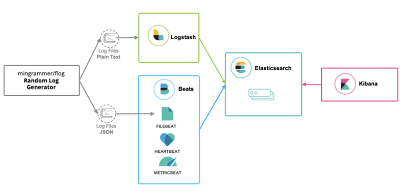

# Ingesta de logs

En esta apartado, vamos a iniciar la ingesta de logs. Necesitaremos un componente del stack elastic que nos haga el tail de esos logs.

La decisión sobre que usar depende de ti.

1. ¿Dispones de logs en formato JSON directamente?
2. ¿O tus logs son en formato texto plano?

Para que nos entendamos, ¿el aspecto de tus logs es este?

```
2019-10-01T14:23:10.180Z nationalviral.io molestias 8974 ID85 - Try to bypass the SSL driver, maybe it will generate the optical feed!
2019-10-01T14:23:10.180Z directredefine.org nemo 5382 ID819 - If we program the monitor, we can get to the AI transmitter through the bluetooth RSS capacitor!
```

¿O más bien este?

```json
{"timestamp":1569939745276,"message":"2019-10-01T14:22:25.276Z customere-services.org est 693 ID363 - The IB alarm is down, hack the back-end driver so we can input the HDD hard drive!"}
{"timestamp":1569939745276,"message":"2019-10-01T14:22:25.276Z centralcross-media.com exercitationem 7240 ID11 - Parsing the protocol won't do anything, we need to transmit the multi-byte AI array!"}
```

En este tutorial, podrás escoger lo que más te apetezca: **¡Elige tu propia aventura!**

1. Adoro JSON ¡voy a usar **Filebeat**!
2. Mis logs son más bien "legacy", ¡usaré **Logstash**!

Para simular una aplicación generando logs, dispondremos de un generador aleatorio basado en [Flog](https://github.com/mingrammer/flog).



En el segundo caso, habitualmente los logs los leeríamos con Filebeat, para enviarlos a logstash. Para simplificar el tutorial, haremos que Logstash nos haga directamente el tail sobre los ficheros de logs generados.

Según tu elección, sigue las instrucciones siguientes:

1. [Ingesta de logs con Filebeat](./filebeat.md)
2. [Ingesta de logs con Logstash](./logstash.md)