# Ingesta de logs con Filebeat

Vamos a empezar modificando el fichero [docker-compose.yml](../../docker-compose.yml), descomentando el servicio filebeat:

```yaml
  # Filebeat container
  filebeat:
    container_name: filebeat
    hostname: filebeat
    image: "docker.elastic.co/beats/filebeat:${ELK_VERSION}"
    volumes:
      # Mount filebeat configuration
      - ./filebeat/config/filebeat.yml:/usr/share/filebeat/filebeat.yml
      # Mount log directory into container /tmp/log
      - ./test/:/var/log/
    networks:
      - elk
    restart: on-failure
    depends_on:
      elasticsearch: { condition: service_healthy } 
```

Crearemos también una carpeta test en el raíz del proyecto:

```shell
mkdir test
```

Y ejecutaremos el siguiente comando para empezar a generar logs dentro de la carpeta test.

```shell
docker run -it --name flog_json --rm immavalls/flog:1.0 -l -f rfc5424 -y json -d 1 -s 1 > ./test/sample-json-logs.log
```

Si queremos parar la generación de logs, bastará con ejecutar `Ctrl-C` y parar el contenedor docker que está generando logs.

Por ahora, sin parar el contenedor, abriendo otro terminal comprobemos que se estan generando logs cada segundo.

```
tail -f ./test/sample-json-logs.log
```

Paramos este tail con `Ctrl-C`, y arrancamos filebeat.

```shell
docker-compose up -d
```

Comprobamos que filebeat arranca bien:

```shell
docker logs -f filebeat
```

## Visualización vía Logs UI

Volvemos a Kibana, y selecionamos en el menú de la izquierda `Logs`.

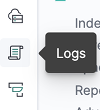

Veremos logs logs que están entrando en el sistema generados por Flog.

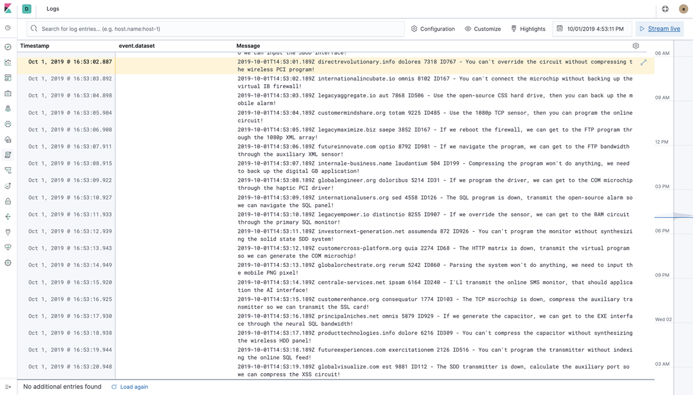

Si pulsamos en la esquina superior derecha, `Stream Live`, se irán actualizando los logs a medida que llegan a elasticsearch.

También podemos modificar el tamaño de letra de los logs, si queremos hacer wrapping, etc. con la opción del menú `Customize`.

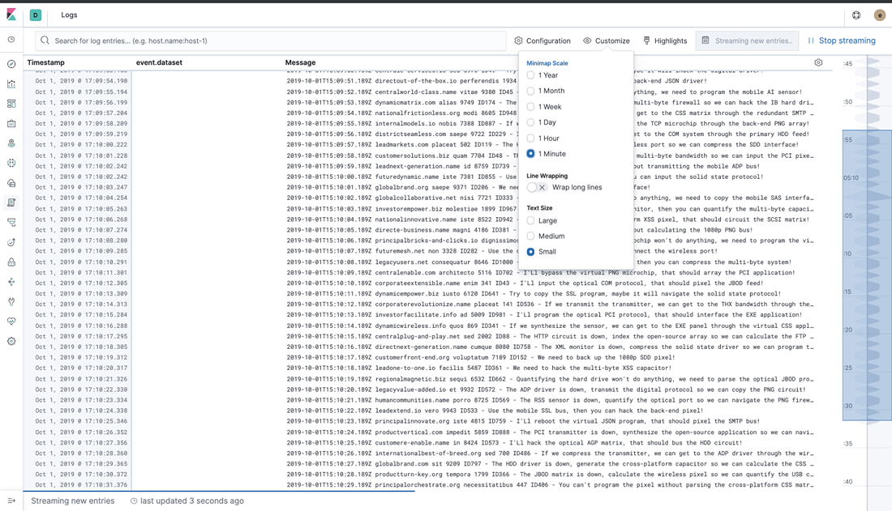

Pulsando en `Configuration`, se puede modificar que [índices](https://www.elastic.co/guide/en/elasticsearch/reference/6.2/_basic_concepts.html#_index) de elasticsearch kibana nos va a mostrar, el campo a usar como `timestamp`, etc. Interesante en la configuración, ir a la segunda pestaña, `Log Columns`, donde podemos indicar qué campos queremos mostrar en la pantalla.

Dado que no tenemos el campo `event.dataset`...

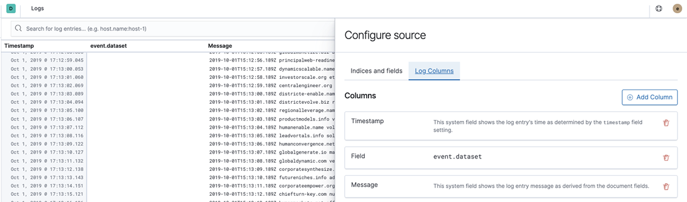

lo podemos eliminar y guardar con `Update source`.

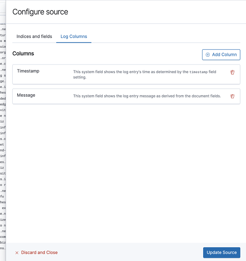

A partir de aquí la vista de los logs presentará el siguiente aspecto.

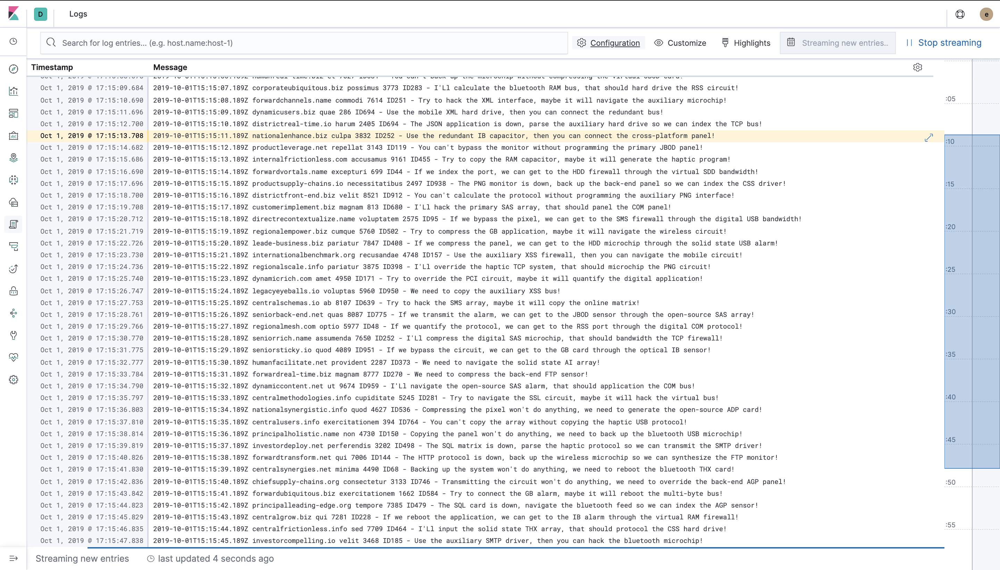

Podemos igualmente usar la barra de búsqueda superior para filtrar los logs. En los ejemplos, buscamos el texto `override the driver` o `calculate`.

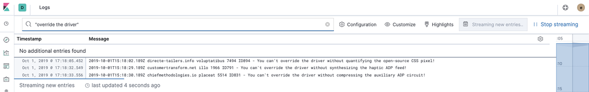
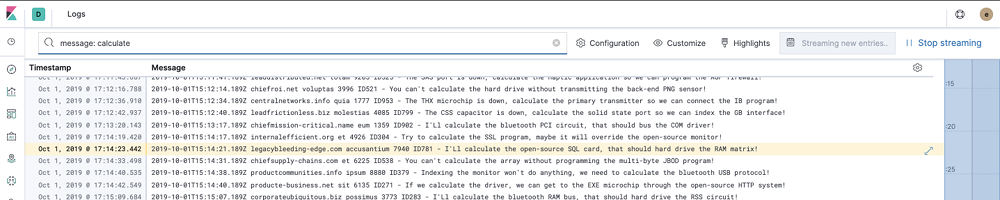

Finalmente, paramos el contenedor que nos está generando logs, con `Ctrl-C` en el terminal dónde lo arrancamos con `docker run ...`. O directamente ejecutando:

```shell
docker stop flog_json
```

Para pasar al siguiente apartado, pararemos también filebeat ejecutando:

```shell
docker-compose stop filebeat
```

Y en Kibana borraremos el índice generado para los logs de Filebeat. Para ello, selecciona en el menú izquierdo `Management`.

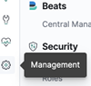

Selecciona `Index Management` en el grupo Elasticsearch.

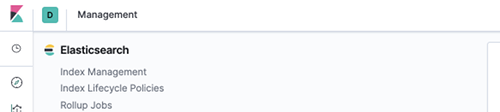

Y borra el índice o índices `filebeat`.

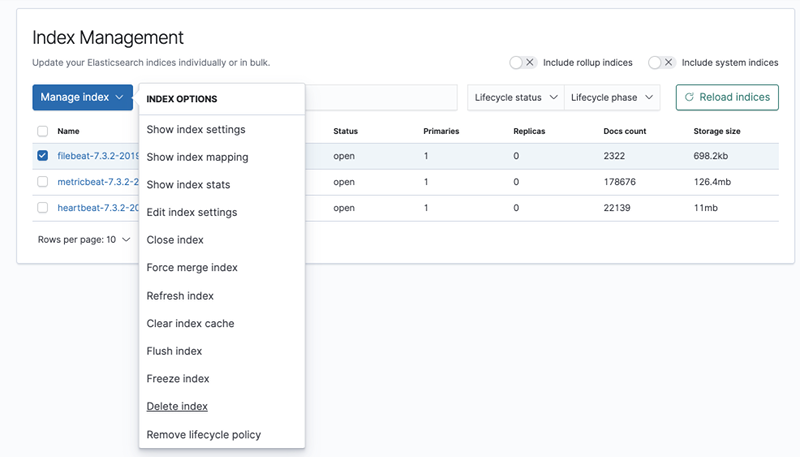

Y ya podemos pasar al siguiente apartado, **[Modelado de logs](../paso03/README.md)**.