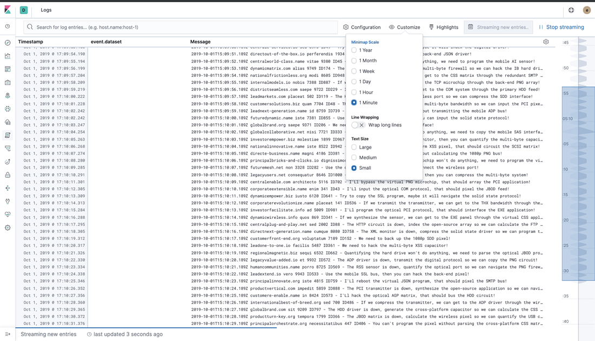

# Ingesta de logs con Logstash

Vamos a empezar modificando el fichero [docker-compose.yml](../../docker-compose.yml), descomentando el servicio logstash:

```yaml
  logstash:
    image: docker.elastic.co/logstash/logstash:${ELK_VERSION}
    container_name: logstash
    hostname: logstash
    volumes:
      # Mount logstash configuration with centralized pipeline management
      - ./logstash/config/logstash.yml:/usr/share/logstash/config/logstash.yml:ro
      # Mount log location on host
      - ./test:/var/log/
    ports:
      - "9600:9600"
    environment:
      LS_JAVA_OPTS: "-Xmx256m -Xms256m"
    networks:
      - elk
    depends_on:
      elasticsearch: { condition: service_healthy }
```

Crearemos también una carpeta test en el raíz del proyecto:

```shell
mkdir test
```

Y ejecutaremos el siguiente comando para empezar a generar logs dentro de la carpeta test.

```shell
docker run -it --name flog_plain --rm immavalls/flog:1.0 -l -f rfc5424 -y plain -d 1 -s 1 > test/sample-plain-logs.log
```

Si queremos parar la generación de logs, bastará con ejecutar `Ctrl-C` y parar el contenedor docker que está generando logs.

Por ahora, sin parar el contenedor, abriendo otro terminal comprobemos que se estan generando logs cada segundo.

```
tail -f ./test/sample-plain-logs.log
```

Paramos este tail con `Ctrl-C`, y arrancamos logstash.

```shell
docker-compose up -d
```

## Alta de pipeline para ingesta de logs

En Logstash vamos a usar la [gestión centralizada de pipelines](https://www.elastic.co/guide/en/logstash/7.3/logstash-centralized-pipeline-management.html).

Logstash transforma los datos de entrada en tres pasos, `input` (lectura de datos), `filter` (transformación) y `output` (envío de datos). Para más información sobre como configurar logstash, ver la [documentación](https://www.elastic.co/guide/en/logstash/7.3/configuration.html).


Iremos al menú de Management en Kibana, seleccionando a la izquierda:


Y dentro del menú de gestión, en el grupo `Logstash`, seleccionaremos `Pipelines`.


Clicamos en el botón `Create pipeline` y damos de alta la siguiente pipeline, con el nombre `flog`:

```json
input {
    file {
        id => "flogs_input"
        path => "/var/log/sample-plain-logs.log"
    }
}
filter {
}
output {
    elasticsearch {
        id => "elastic-flogs-output"
		hosts => "elasticsearch:9200"
		user => elastic
		password => changeme
		index => "logstash-flog-%{+YYYY.MM}"
	}
}
```


Pulsaremos el botón `Create and deploy`.

Observemos que simplemente leemos datos de un fichero de logs en el `input`, montado en `/var/log` dentro del contenedor, y enviamos la salida a elasticsearch en el bloque `output`.

En este paso, no modicaremos la estructura del log. Por lo tanto, ante una línea en el log de entrada con el formato parecido a este:

```json
2019-09-30T07:21:02.111Z leadengage.info omnis 7009 ID418 - Connecting the microchip won't do anything, we need to override the auxiliary PNG protocol!
```

Enviaremos a elasticsearch un documento JSON similar a este, con un campo `@timestamp` que contiene la fecha en que logstash ingesta este documento, y otro campo `message` con el contenido de cada línea de log leída del fichero de logs de entrada:

```json
{"@timestamp" : "2019-10-02T08:42:36.099Z",
"message" : "2019-09-30T07:21:02.111Z leadengage.info omnis 7009 ID418 - Connecting the microchip won't do anything, we need to override the auxiliary PNG protocol!"}
```

Comprobamos que logstash arranca correctamente al dar de alta esta pipeline:

```shell
docker logs -f logstash
```

## Visualización vía Logs UI

Volvemos a Kibana, y selecionamos en el menú de la izquierda `Logs`.


Veremos logs logs que están entrando en el sistema generados por Flog.


Si pulsamos en la esquina superior derecha, `Stream Live`, se irán actualizando los logs a medida que llegan a elasticsearch.

También podemos modificar el tamaño de letra de los logs, si queremos hacer wrapping, etc. con la opción del menú `Customize`.



Pulsando en `Configuration`, se puede modificar que [índices](https://www.elastic.co/guide/en/elasticsearch/reference/6.2/_basic_concepts.html#_index) de elasticsearch kibana nos va a mostrar, el campo a usar como `timestamp`, etc. Interesante en la configuración, ir a la segunda pestaña, `Log Columns`, donde podemos indicar qué campos queremos mostrar en la pantalla.

Dado que no tenemos el campo `event.dataset`...


lo podemos eliminar y guardar con `Update source`.


A partir de aquí la vista de los logs presentará el siguiente aspecto.


Podemos igualmente usar la barra de búsqueda superior para filtrar los logs. En los ejemplos, buscamos el texto `override the driver` o `calculate`.


Finalmente, paramos el contenedor que nos está generando logs, con `Ctrl-C` en el terminal dónde lo arrancamos con `docker run ...`. O directamente ejecutando:

```shell
docker stop flog_plain
```

Para pasar al siguiente apartado, pararemos también filebeat ejecutando:

```shell
docker-compose stop logstash
```

Y en Kibana borraremos el índice generado para los logs de Logstash. Para ello, selecciona en el menú izquierdo `Management`.


Selecciona `Index Management` en el grupo Elasticsearch.


Y borra el índice o índices `logstash-flog`.


Y ya podemos pasar al siguiente apartado, **[Modelado de logs](../paso03/README.md)**.
