# Modelado Simple de Logs con Filebeat

En este punto, el documento que llega a elastic tiene este aspecto:

```json
{"timestamp" : 1569846065739,
"message" : "2019-09-30T12:21:04.702Z leadengage.info omnis 7009 ID418 - Connecting the microchip won't do anything, we need to override the auxiliary PNG protocol!"}
```

Y nos gustaría que en elastic se guardara como:

```json
{
          "process_id" : "7009",
          "message_content" : "Connecting the microchip won't do anything, we need to override the auxiliary PNG protocol!",
          "@timestamp" : "2019-09-30T12:21:04.702Z",
          "process_name" : "omnis",
          "message_id" : "ID418",
          "event_data" : "-",
          "host_name" : "leadengage.info",
          "timestamp" : 1569846065739
}
```

Para realizar esta transformación, recurriremos a las pipelines de ingesta de elasticsearch, que se ejecutarán en los [nodos de ingesta](https://www.elastic.co/guide/en/elasticsearch/reference/7.3/ingest.html).

Dado que tenemos un cluster elasticsearch con un sólo nodo, este nodo realizará todos los roles (master, data, ingest, etc.). Más información sobre roles de los nodos en la [documentación](https://www.elastic.co/guide/en/elasticsearch/reference/7.3/modules-node.html).

Las pipelines de ingesta proporcionan a elasticsearch un mecanismo para pre-procesar los documentos de entrada antes de almacenarlos. Con una pipeline, podemos parsear, transformar y enriquecer los datos de entrada. Se trata de un conjunto de [procesadores](https://www.elastic.co/guide/en/elasticsearch/reference/7.3/ingest-processors.html) que se aplican de forma secuencial a los documentos de entrada, para generar el documento definitivo que almacenará elasticsearch.

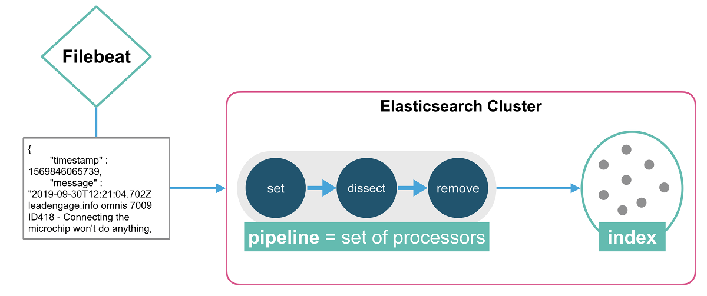

En este apartado realizaremos:

1. Ingesta de logs estruturados usando una pipeline de ingesta en elasticsearch.
2. Visualización de logs en Kibana Discover.
3. Creación de un Dashboard simple en Kibana.

## Creación de la pipeline de ingesta

En primer lugar, vamos a crear una simple pipeline de ingesta, basada en un procesador de tipo [dissect](https://www.elastic.co/guide/en/elasticsearch/reference/7.3/dissect-processor.html), que nos parseará el campo `message` de entrada, en los diversos campos que queremos a la salida (`process_name`, `process_id`, `host_name`, etc).

Antes de crear esa pipeline, es interesante simular cual sería su comportamiento. Para ello, en Kibana seleccionaremos en el menú de la izquierda `Dev Tools`.


Y pegaremos lo siguiente en la consola:

```json
POST _ingest/pipeline/_simulate
{
  "pipeline": {
    "description": "_description",
    "processors": [
      {
        "dissect": {
          "field": "message",
          "pattern": "%{@timestamp} %{host_name} %{process_name} %{process_id} %{message_id} %{event_data} %{message_content}"
        }
      },
      {
        "remove": {
          "field": "message"
        }
      }
    ]
  },
  "docs": [
    {
      "_source": {
        "timestamp" : 1569846065739,
        "message" : "2019-09-30T12:21:04.702Z leadengage.info omnis 7009 ID418 - Connecting the microchip won't do anything, we need to override the auxiliary PNG protocol!"
      }
    }
  ]
}
```

Al ejecutar esta petición, podremos comprobar si el JSON resultante es el esperado.

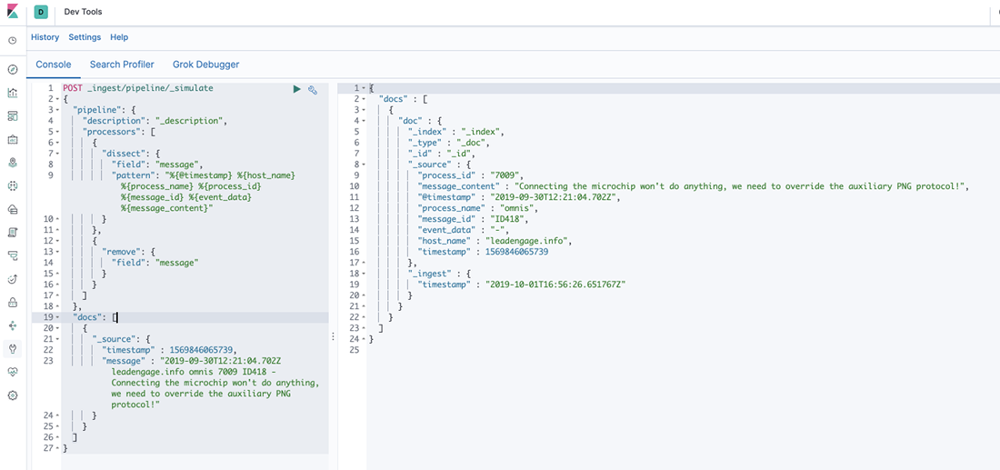

Esta petición [simula](https://www.elastic.co/guide/en/elasticsearch/reference/7.3/simulate-pipeline-api.html) una pipeline, usando en endpoint el API REST de elasticsearch `_ingest/pipeline/_simulate`. En el contenido del cuerpo, tenemos un JSON con los procesadores de la pipeline:

- **dissect**: Se encarga de separar el texto que viene en el campo message a partir de los espacios en blanco, y crea distintos campos (timestamp, host_name, process_name, etc.) con los valores que extrae del campo message de entrada.
- **remove**: eliminará el campo `message`, una vez modelado, no nos interesa guardara esta información redundante.

Una vez comprobamos que la pipeline de ingesta funciona según deseamos, la daremos de alta en elasticsearch para poder usarla. Para ello, en la misma consola de Dev Tools, ejecutaremos:

```json
PUT _ingest/pipeline/logs-pipeline
{
  "description": "Pipeline para ingesta de logs",
  "processors": [
    {
      "dissect": {
        "field": "message",
        "pattern": "%{@timestamp} %{host_name} %{process_name} %{process_id} %{message_id} %{event_data} %{message_content}"
      }
    },
    {
      "remove": {
        "field": "message"
      }
    }
  ]
}
```

Creando la pipeline de ingesta **logs-pipeline**, que usaremos en el siguiente apartado.

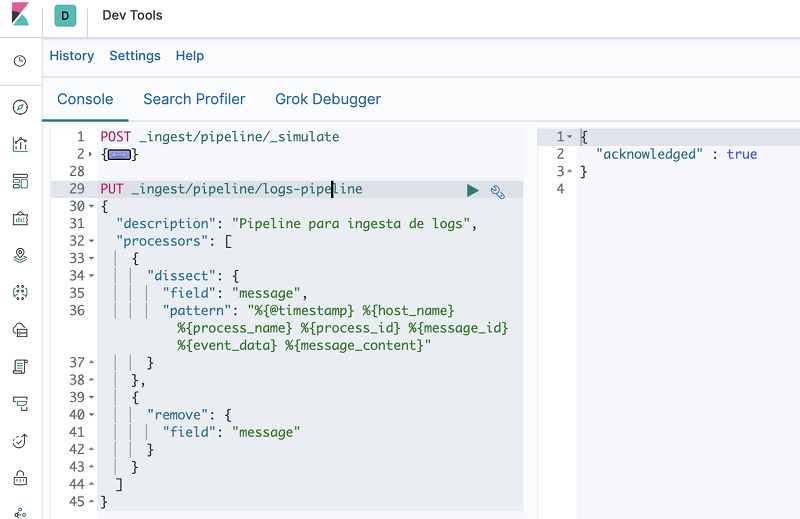

## Configuracion de Filebeat

Ahora tenemos que indicar a elasticsearch que los documentos que vayan a ser almacenados en los índices creados por filebeat deben ejecutar primero esta pipeline. Para ello, editaremos el fichero de configuración de filebeat. [filebeat/config/filebeat.yml](../../filebeat/config/filebeat.yml), y en la sección `output.elasticsearch` descomentaremos la línea `pipeline: logs-pipeline`.

```yaml
output.elasticsearch:
  hosts: ["elasticsearch:9200"]
  username: '${ES_USERNAME:elastic}'
  password: '${ES_PASSWORD:changeme}'
  pipeline: logs-pipeline
```

## Ingesta de logs estructurados

Ya estamos listos para arrancar de nuevo nuestro generador de logs:

```shell
docker run -it --name flog_json --rm immavalls/flog:1.0 -l -f rfc5424 -y json -d 1 -s 1 > ./test/sample-json-logs.log
```

Y arrancar de nuevo `filebeat`.

```shell
docker-compose up -d
```

Podemos comprobar que no haya errores en la ejecución de filebeat, antes de pasar al siguiente apartado:

```shell
docker logs -f filebeat
```

## Visualizar logs en Discover

Volvemos a Kibana. Para visualizar los logs debemos primero crear un [Index Pattern](https://www.elastic.co/guide/en/kibana/7.3/tutorial-define-index.html). Los index patterns nos permiten acceder a los índices en elasticsearch, y, por lo tanto, a los documentos que tenemos almacenados en estos índices.

Si no le indicamos lo contrario en la configuración de filebeat para envío a elasticsearch, los índices que se crearán son con el nombre `filebeat-*`.

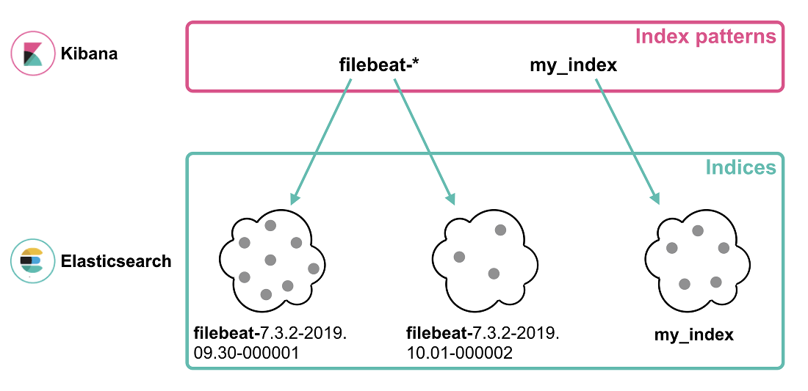

Por lo tanto, en la sección de Management de Kibana, seleccionamos `Index Patterns` en el grupo `Kibana`.


Pulsamos el botón azul `Create Index Pattern` y damos de alta un patrón `filebeat-*`.

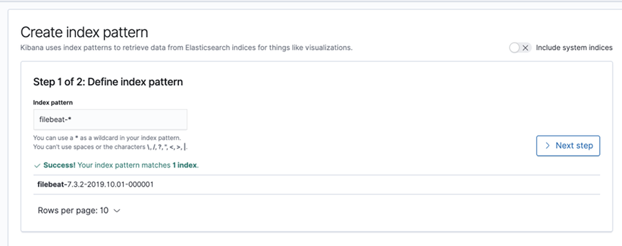

Hacemos clic en `Next step`y seleccionaremos el campo a usar para mostrar la serie temporal de datos en Discover. En 
este caso, escogemos `@timestamp`.

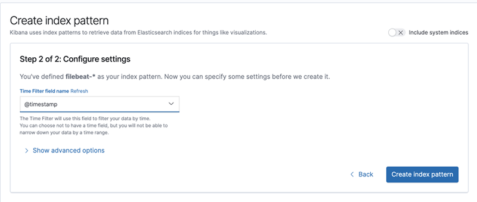

Y pulsams `Create Index Pattern`.

Seleccionamos en el menú de la izquierda en Kibana `Discover`. 

Hacemos clic en `New` en el menú superior, para limpiar cualquier filtro que tuviéramos en la búsqueda. 

Y en el selector escogemos el index pattern que acabamos de crear, `filebeat-*`.

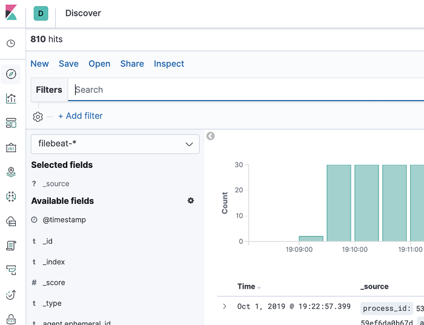

Es posible usar la barra de búsqueda para filtrar nuestros datos. Por ejemplo, seleccionar `event_name:` y nos proporcionará sugerencias para filtrar la búsqueda. En el ejemplo, podemos filtrar por `event_data: "ID222" or event_data: "ID638"`

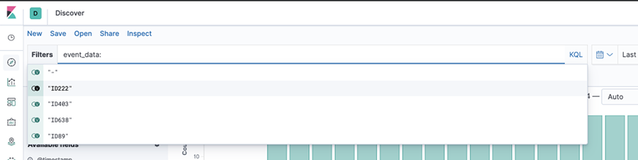

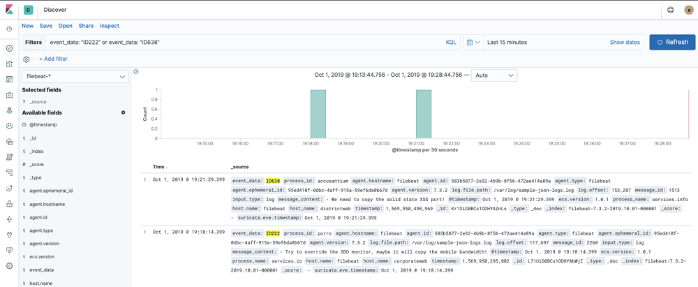

El lenguage por defecto es [Kibana Query Language (KQL)](https://www.elastic.co/guide/en/kibana/7.3/kuery-query.html). 

Eliminamos el filtro de las búsquedas.

Finalmente, vamos a crear una tabla para utilizarla en la construcción del Dashboard en el siguiente apartado. Queremos una vista que nos muestre `host_name` y `process_name`. En la lista de campos disponibles, localizamos esos campos y pulsamos el botón azul `add` para ambos.

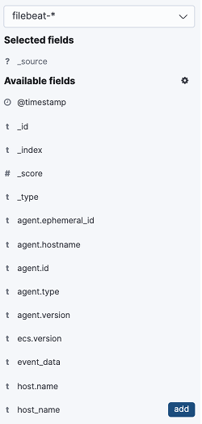

El resultado será una tabla como la siguiente.

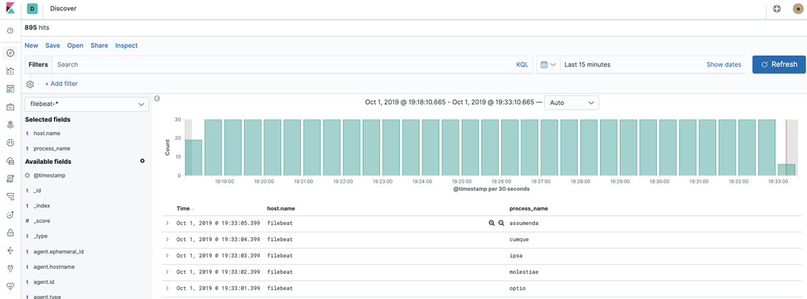

Pulsaremos el botón `Save` en la barra superior y guardaremos la búsqueda con el nombre `[Filebeat] Host/Process`

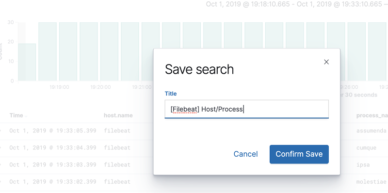

## Creación de Dashboard en Kibana

## Finalizamos

Y para finalizar, podemos eliminar todo lo creado hasta el momento, liberando recursos, ejecutando:

```shell
docker-compose down -v
```

> `-v` para eliminar el volumen de datos de elasticsearch

Y pasaremos a comentar cuales podrían ser los [**siguientes pasos**](../paso04/README.md).