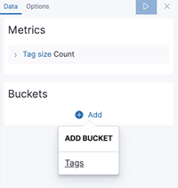
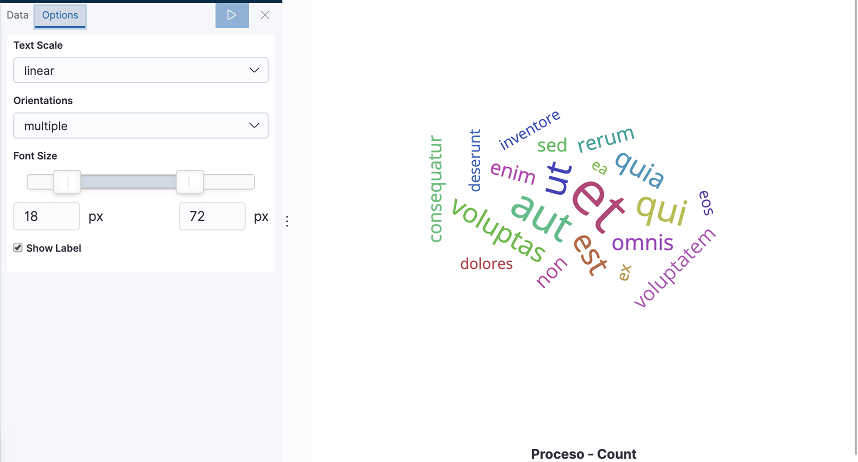

# Modelado Simple de Logs con Logstash

En este punto, el documento que llega a elastic tiene este aspecto:

```json
{"@timestamp" : 1569846065739,
"message" : "2019-09-30T12:21:04.702Z leadengage.info omnis 7009 ID418 - Connecting the microchip won't do anything, we need to override the auxiliary PNG protocol!"}
```

Y nos gustaría que en elastic se guardara como:

```json
{
          "process_id" : "7009",
          "message_content" : "Connecting the microchip won't do anything, we need to override the auxiliary PNG protocol!",
          "@timestamp" : "2019-09-30T12:21:04.702Z",
          "process_name" : "omnis",
          "message_id" : "ID418",
          "event_data" : "-",
          "host_name" : "leadengage.info",
          "timestamp" : 1569846065739
}
```

Para realizar esta transformación, recurriremos a transformar en logstash el documento de entrada, mediante la sección `filter` de las pipeline.

En este apartado realizaremos:

1. Modificación de la pipeline de Logstash para transformar los datos.
2. Visualización de logs en Kibana Discover.
3. Creación de un Dashboard simple en Kibana.

## Modificación de la pipeline de ingesta en Logstash

En primer lugar, modificaremos la pipeline en Logstash usando un filtro de tipo [dissect](https://www.elastic.co/guide/en/elasticsearch/reference/7.3/dissect-processor.html), que nos parseará el campo `message` de entrada, y nos permitirá crear los diversos campos que queremos a la salida (`process_name`, `process_id`, `host_name`, etc).

Volvemos a Kibana, menú de `Management`, y dentro de Management, editamos la pipeline `flog`de logstash para añadir en la sección de filter lo siguiente:

```
filter {
    dissect {
       mapping => {
         "message" => "%{timestamp} %{host_name} %{process_name} %{process_id} %{message_id} %{event_data} %{message_content}"
       }
     }
	mutate { remove_field => [ "message" ] }
}
```

Y aplicaremos el cambio pulsando `Create and deploy`.


La lista de filtros completa la podemos consultar en la [documentación](https://www.elastic.co/guide/en/logstash/7.3/filter-plugins.html). En este caso, aplicamos dos filtros simples:

- [**dissect**](https://www.elastic.co/guide/en/logstash/7.3/plugins-filters-dissect.html): Se encarga de separar el texto que viene en el campo message a partir de los espacios en blanco, y crea distintos campos (timestamp, host_name, process_name, etc.) con los valores que extrae del campo message de entrada.
- [**mutate**](https://www.elastic.co/guide/en/logstash/7.3/plugins-filters-mutate.html): eliminará el campo `message`, una vez modelado, no nos interesa guardara esta información redundante.

## Ingesta de logs estructurados

Ya estamos listos para arrancar de nuevo nuestro generador de logs:

```shell
docker run -it --name flog_plain --rm immavalls/flog:1.0 -l -f rfc5424 -y plain -d 1 -s 1 > ./test/sample-plain-logs.log
```

Y arrancar de nuevo `logstash`, en un terminal a parte.

```shell
docker-compose up -d
```

Podemos comprobar que no haya errores en la ejecución de logstash, antes de pasar al siguiente apartado:

```shell
docker logs -f logstash
```

Esperando al mensaje:

```shell
[2019-10-02T09:55:19,994][INFO ][logstash.agent           ] Pipelines running {:count=>2, :running_pipelines=>[:".monitoring-logstash", :flog], :non_running_pipelines=>[]}
[2019-10-02T09:55:20,896][INFO ][logstash.agent           ] Successfully started Logstash API endpoint {:port=>9600}
```

## Visualizar logs en Discover

Volvemos a Kibana. 

Para visualizar los logs debemos primero crear un [Index Pattern](https://www.elastic.co/guide/en/kibana/7.3/tutorial-define-index.html). Los index patterns nos permiten acceder a los índices en elasticsearch, y, por lo tanto, a los documentos que tenemos almacenados en estos índices.

Si no le indicamos lo contrario en la configuración de filebeat para envío a elasticsearch, los índices que se crearán son con el nombre `logstash-flog-*`.


Por lo tanto, en la sección de Management de Kibana, seleccionamos `Index Patterns` en el grupo `Kibana`.


Pulsamos el botón azul `Create Index Pattern` y damos de alta un patrón `logstash-flog-*`.


Hacemos clic en `Next step`y seleccionaremos el campo a usar para mostrar la serie temporal de datos en Discover. En este caso, escogemos `timestamp`.


Y pulsamos `Create Index Pattern`.

Seleccionamos en el menú de la izquierda en Kibana `Discover`. 

Hacemos clic en `New` en el menú superior, para limpiar cualquier filtro que tuviéramos en la búsqueda. 

Y en el selector escogemos el index pattern que acabamos de crear, `logstash-flog-*`.


Es posible usar la barra de búsqueda para filtrar nuestros datos. Por ejemplo, seleccionar `event_name:` y nos proporcionará sugerencias para filtrar la búsqueda. En el ejemplo, podemos filtrar por `event_data: "ID882" or event_data: "ID972"`


El lenguage usado para filtrar las búsquedas es [Kibana Query Language (KQL)](https://www.elastic.co/guide/en/kibana/7.3/kuery-query.html).

**Eliminamos** el filtro de las búsquedas para recuperar todos los datos.

Finalmente, vamos a crear una tabla para utilizarla en la construcción del Dashboard en el siguiente apartado. Queremos una vista que nos muestre `host_name` y `process_name`. En la lista de campos disponibles, localizamos esos campos y pulsamos el botón azul `add` para ambos.


El resultado será una tabla como la siguiente.


Pulsaremos el botón `Save` en la barra superior y guardaremos la búsqueda con el nombre `[Logstash] Host/Process`


## Creación de Dashboard en Kibana

Vamos a crear un simple dashboard en Kibana para visualizar nuestros datos. Para ello, crearemos primero diversas visualizaciones.

En Kibana, seleccionar el menú `Visualize`.


Clic en el botón `Create new visualization`, y seleccionar el tipo `Pie`.


En el siguiente paso, `Choose a source`, seleccionar la búsqueda guardada como `[Logstash] Host/Process`.


En la visualización, pulsar el enlace `+Add` bajo Buckets, y seleccionar `Split slices`.


Seleccionar una `Terms` aggregation, sobre el campo `host_name.keyword` y pulsar la flecha azul para aplicar los cambios.


Añadir una segunda agregación en buckets, de tipo `Terms`, sobre el campo `process_name.keyword`. Y aplicar el cambio.


Aplicar y comprobar el resultado.


Pulsar el enlace `Save` en la barra superior y guardar la visualización con el nombre `[Logstash] Process/Host pie`.

Pulsar en el enlace `Visualize` en la barra superior de navegación y crear una segunda visualización, de tipo `Tag Cloud`.  


Seleccionar la misma fuente de datos, la búsqueda guardada como `[Logstash] Host/Process`. Y bajo `Buckets` en la visualización, añadir `Tags`.



Y añadir una agregación de nuevo de tipo `Terms`, sobre el campo `process_name.keyword`, modificando el tamaño por defecto de 5 a 20.


Cambiar de la pestaña `Data` a `Options` y modificar `Orientations` a `multiple`.


Aplicar los cambios.



Guardar esta visualización con el nombre `[Logstash] Process/Host cloud tag`.

Pasaremos finalmente a crear un dashboard que incluya estas visualizaciones.

Seleccionamos en el menú de la izquierda `Dashboard`. Y creamos un nuevo dashboard pulsando el botón `Create new dashboard`. Si estamos visualizando otro dashboard, volver al menús clicando en el enlace `Dashboard` en el menú superior.


Clicar en el enlace `Add` en el menú superior.


Y añadir las dos visualizaciones guardadas `[Logstash] Process/Host cloud tag`, `[Logstash] Process/Host pie`, y la búsqueda `[Logstash] Host/Process`.

Guardar con el nombre `[Logstash] Dashboard` pulsando la opción `Save`.


Adicionalmente, podemos comprobar que al pulsar por ejemplo en un `host_name.keyword` concreto sobre el `pie chart`, se aplica un filtro a todo el dashboard. En el ejemplo, estamos filtrando por `host_name: forwardconvergence.name`.


## Finalizamos

Para finalizar, comentaremos cuales podrían ser los [**siguientes pasos**](../paso04/README.md).